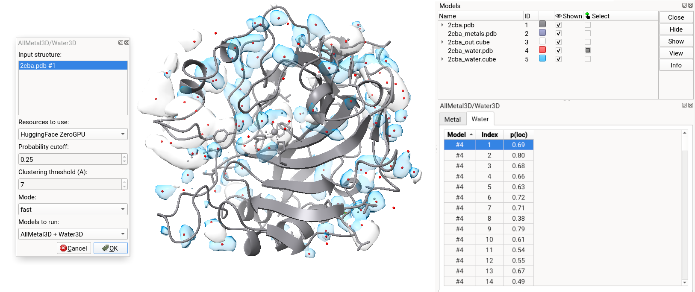

%% [markdown]
# ChimeraX Plugin


We offer a ChimeraX plugin that you can use in ChimeraX on Mac, Windows and Linux. 

It is possible to use it either with our provided inference server using HuggingFace Zero GPU or using a local GPU server of your choice. The prediction endpoint will not need to be located on the same device that you can chimerax. 




## Install

The tool is available via the **ChimeraX toolshed**. 

To install go too **Tools** &rarr; **More Tools** and search for *AllMetal3D/Water3D*. 

## Run the tool

The application will be available under **Tools** &rarr; **Structure prediction** or **Tools** &rarr; **Binding Analysis**. 


### Local server only

Follow the instructions to [here](https://lcbc-epfl.github.io/allmetal3d/install) allmetal3d using `pip`. 

Once installed run 
```
allmetal3d_server
```

If you run the server on the same machine as the chimerax instance you can use the `localhost:7860` url. Otherwise, use the the `xxx.gradio.live` url. Select `local GPU` in the dropdown
