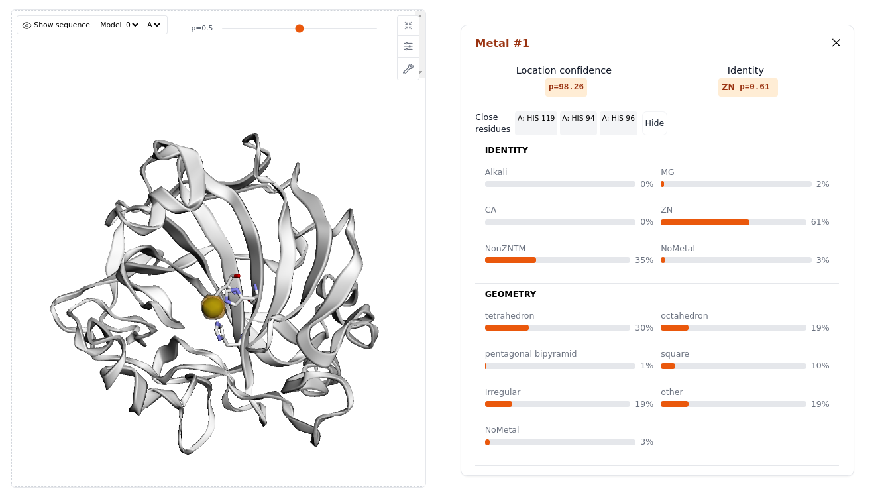

%% [markdown]
# Example usage


## CLI usage

### Predictions
To use `allmetal3d` in a project:

Example command `allmetal3d -i 3zvz.pdb --models all -m fast`

```
usage: allmetal3d [-h] -i INPUT [-a {all,water3d,allmetal3d}] [-m {fast,all,site}] [-c CENTRAL_RESIDUE]
                  [-r RADIUS] [-t THRESHOLD] [-p PTHRESHOLD] [-b BATCH_SIZE] [-o OUTPUT_DIR]

AllMetal3D Command Line Interface

options:
  -h, --help            show this help message and exit
  -i INPUT, --input INPUT
                        Input PDB file
  -a {all,water3d,allmetal3d} --models {all,water3d,allmetal3d}
                        Models
  -m {fast,all,site}, --mode {fast,all,site}
                        Prediction mode
  -c CENTRAL_RESIDUE, --central_residue CENTRAL_RESIDUE
                        Central residue
  -r RADIUS, --radius RADIUS
                        Distance threshold
  -t THRESHOLD, --threshold THRESHOLD
                        Threshold
  -p PTHRESHOLD, --pthreshold PTHRESHOLD
                        Probability Threshold
  -b BATCH_SIZE, --batch_size BATCH_SIZE
                        Batch Size
  -o OUTPUT_DIR, --output_dir OUTPUT_DIR
                        Output directory

```


### Web app



Execute the command `allmetal3d_server` in the installed environment and navigate to the printed url in the format `xxx.gradio.live`

## Within python

### Run predictions
```
import os
import allmetal3d

# download input file
os.system("wget https://files.rcsb.org/download/3zvz.pdb")

allmetal3d.predict("3zvz.pdb")
```
### launch server
```
allmetal3d.launch_server()
```


